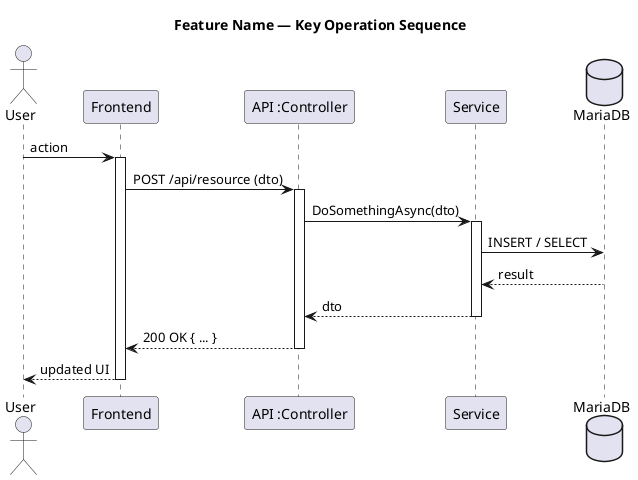
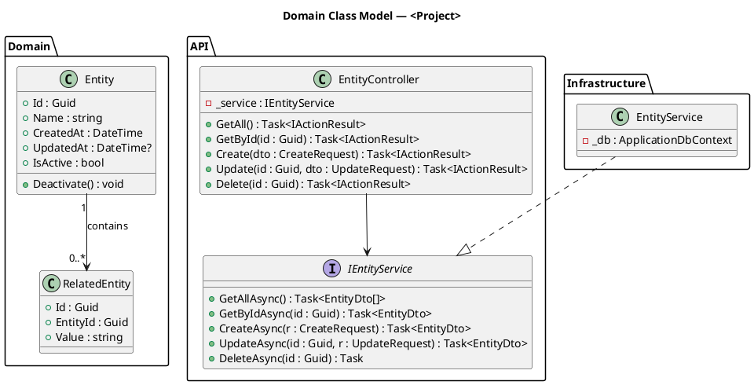
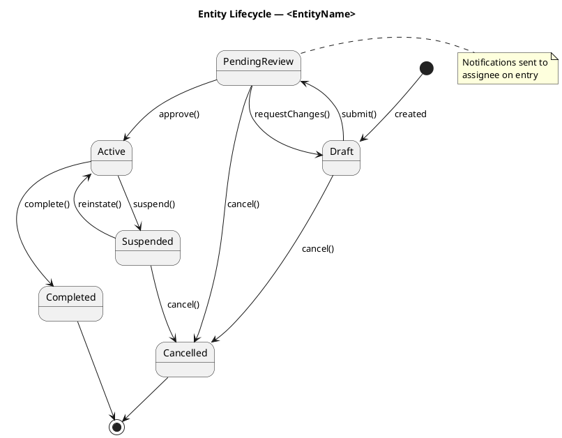
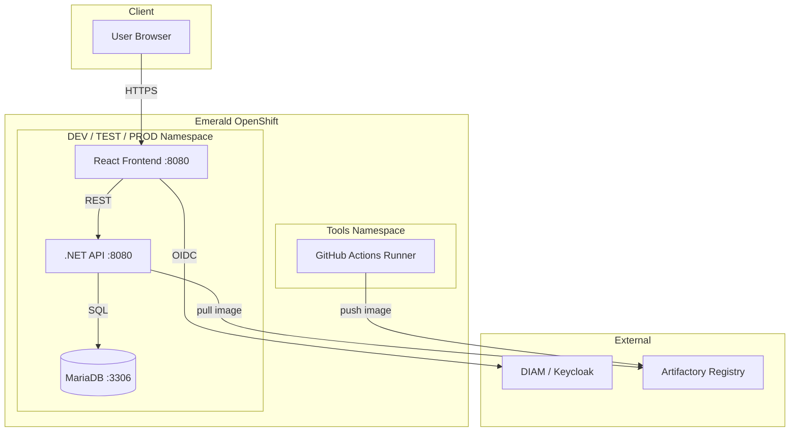

# PlantUML Skeleton Templates

Reference templates for the 5 standard PlantUML diagram types.
Copy-paste the appropriate skeleton, rename, and fill in your project specifics.

---

## Sequence Diagram



---

## Class Diagram



---

## State Diagram



---

## C4 Context + Container

```plantuml
@startuml
title C4 — <Project> Context

!define C4Context
!include https://raw.githubusercontent.com/plantuml-stdlib/C4-PlantUML/master/C4_Context.puml

Person(user, "End User", "Uses the system via browser")
Person(admin, "Administrator", "Manages configuration")

System_Boundary(sys, "<Project>") {
    System(frontend, "React SPA", "Single page application")
    System(api, ".NET 10 API", "REST API")
    System(db, "MariaDB", "Relational data store")
}

System_Ext(keycloak, "DIAM / Keycloak", "Identity provider (OIDC)")
System_Ext(openshift, "Emerald OpenShift", "Container platform")

Rel(user, frontend, "Uses", "HTTPS 443")
Rel(admin, frontend, "Manages", "HTTPS 443")
Rel(frontend, api, "API calls", "HTTPS 443")
Rel(api, db, "Reads/writes", "TCP 3306")
Rel(frontend, keycloak, "Auth", "OIDC / PKCE")
Rel(api, keycloak, "Token validation", "JWKS")

@enduml
```

---

## Mermaid — Architecture Quickview


